# SDLC 全流程指南

> 软件开发全生命周期（Software Development Life Cycle）核心流程与最佳实践

---

## 📋 目录

- [流程总览](#流程总览)
- [1. 从零到一：新项目开发](#1-从零到一新项目开发)
- [2. 持续迭代：二次开发](#2-持续迭代二次开发)
- [3. 质量保障：测试流程](#3-质量保障测试流程)
- [4. 安全防护：漏洞检测](#4-安全防护漏洞检测)
- [5. 文档完善：注释与文档](#5-文档完善注释与文档)
- [6. 稳定运行：运维监控](#6-稳定运行运维监控)
- [7. 问题修复：Bug处理](#7-问题修复bug处理)
- [8. 性能优化：持续改进](#8-性能优化持续改进)

---

## 流程总览

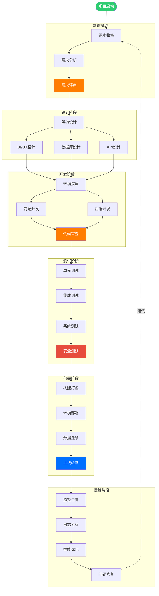

---

## 1. 从零到一：新项目开发

### 1.1 需求阶段

#### 📝 角色：产品经理 + 产品总监
**流程图**：
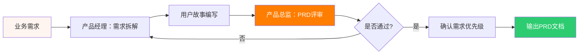

**核心输出物**：
- PRD文档（Product Requirements Document）
- 用户故事（User Stories）
- 功能清单（Feature List）
- 原型图（Prototype）

**使用提示词**：
1. **产品经理** → `需求拆解`场景
2. **产品总监** → `PRD评审`场景

---

### 1.2 架构设计阶段

#### 🏗️ 角色：架构师 + 研发总监
**流程图**：
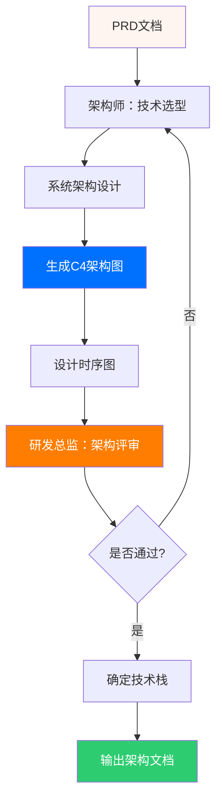

**核心输出物**：
- 系统架构图（C4模型）
- 技术选型报告
- 时序图/流程图
- 数据库ER图
- API设计文档

**使用提示词**：
1. **架构师** → `全链路扫描`、`C4架构图`、`时序图生成`
2. **可视化专家** → `时序图生成`、`架构图与流程图`
3. **研发总监** → `稳定性审计`

---

### 1.3 UI/UX设计阶段

#### 🎨 角色：UI/UX设计师
**流程图**：
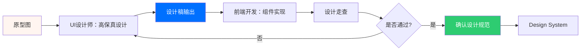

**核心输出物**：
- 高保真设计稿
- 组件库规范
- Design System
- 响应式布局方案

**使用提示词**：
1. **UI/UX设计师** → `原型设计`场景
2. **前端开发** → `组件封装`场景

---

### 1.4 开发环境搭建

#### ⚙️ 角色：运维工程师 + 后端组长
**流程图**：
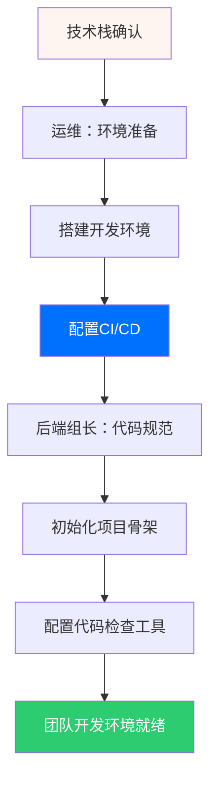

**核心输出物**：
- 项目初始化代码
- CI/CD流水线配置
- 代码规范文档
- 开发环境部署文档

**使用提示词**：
1. **运维工程师** → `自动化部署`、`CI/CD流水线`
2. **后端组长** → `代码审查`场景

---

### 1.5 功能开发阶段

#### 💻 角色：前端开发 + 后端开发 + 项目经理
**并行开发流程**：
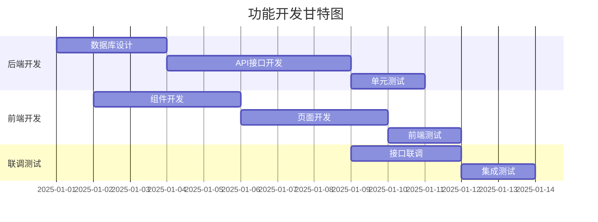

**核心输出物**：
- 后端API服务
- 前端页面和组件
- 单元测试用例
- 接口文档

**使用提示词**：
1. **后端开发** → `企业级API设计`
2. **前端开发** → `组件封装`
3. **项目经理** → `WBS拆解`、`进度跟踪`

---

### 1.6 代码审查阶段

#### 👀 角色：前端组长 + 后端组长 + 安全专家
**流程图**：
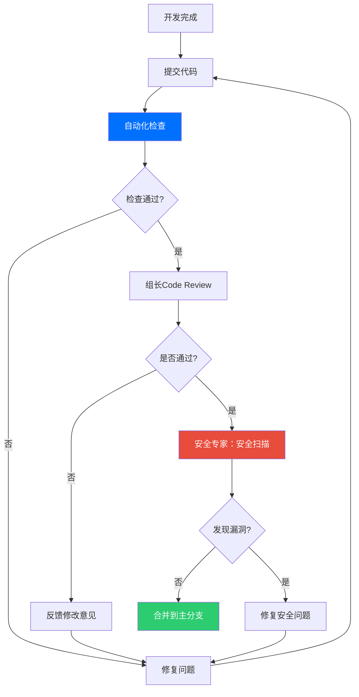

**核心输出物**：
- Code Review报告
- 安全扫描报告
- 代码质量报告
- 技术债务清单

**使用提示词**：
1. **前端组长** → `性能审计`、`Hook规范`
2. **后端组长** → `代码审查`、`架构决策`
3. **安全专家** → `安全扫描`、`并发审计`

---

## 2. 持续迭代：二次开发

### 2.1 现有代码理解

#### 📚 角色：全能助手 + 架构师
**流程图**：
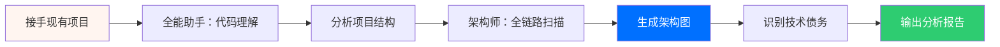

**使用提示词**：
1. **全能助手** → `遗留代码理解`场景
2. **架构师** → `全链路扫描`场景
3. **可视化专家** → `架构图与流程图`

---

### 2.2 需求变更管理

#### 📋 角色：产品总监 + 项目经理
**流程图**：
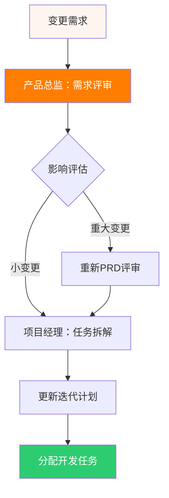

**使用提示词**：
1. **产品总监** → `PRD评审`、`路线图规划`
2. **项目经理** → `WBS拆解`、`风险管理`

---

### 2.3 重构与优化

#### 🔧 角色：后端组长 + 前端组长
**流程图**：
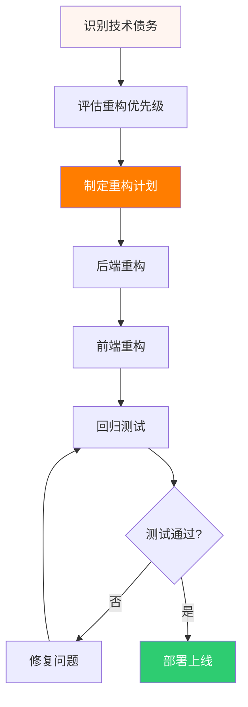

**使用提示词**：
1. **后端组长** → `技术债务管理`、`架构决策`
2. **前端组长** → `性能优化`、`工程化规范`

---

## 3. 质量保障：测试流程

### 3.1 测试金字塔

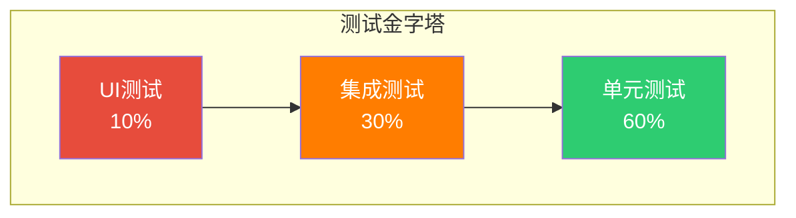

### 3.2 完整测试流程

#### 🧪 角色：测试工程师 + 开发者
**流程图**：
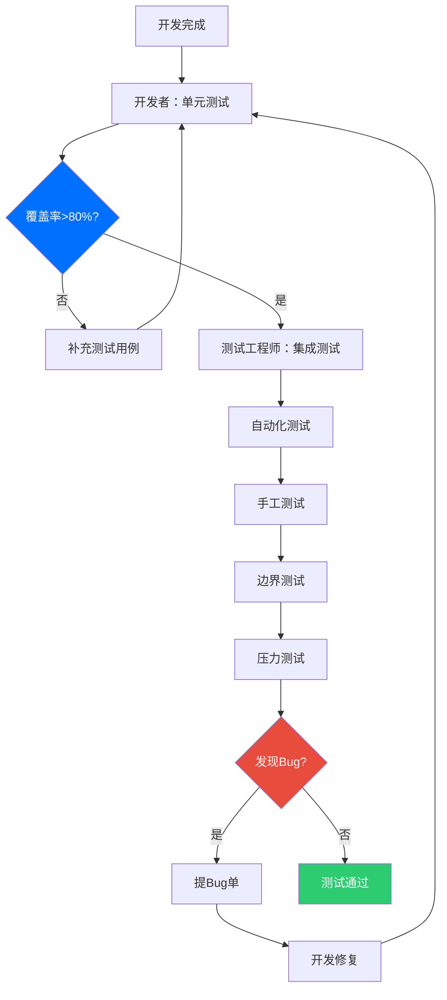

**使用提示词**：
1. **测试工程师** → `自动化测试`、`边界测试`
2. **安全专家** → `安全测试`

---

## 4. 安全防护：漏洞检测

### 4.1 安全检测流程

#### 🛡️ 角色：安全专家 + 运维组长
**流程图**：
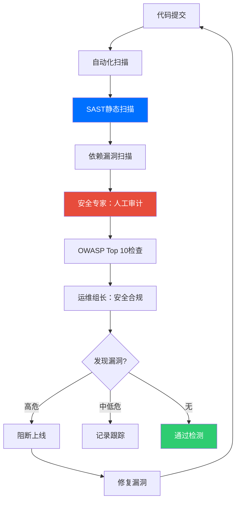

**核心检查项**：
- SQL注入
- XSS跨站脚本
- CSRF跨站请求伪造
- 敏感信息泄露
- 不安全的反序列化
- 权限控制缺陷
- 依赖组件漏洞

**使用提示词**：
1. **安全专家** → `安全扫描`、`并发审计`
2. **运维组长** → `安全检查`、`K8s审计`

---

## 5. 文档完善：注释与文档

### 5.1 文档体系

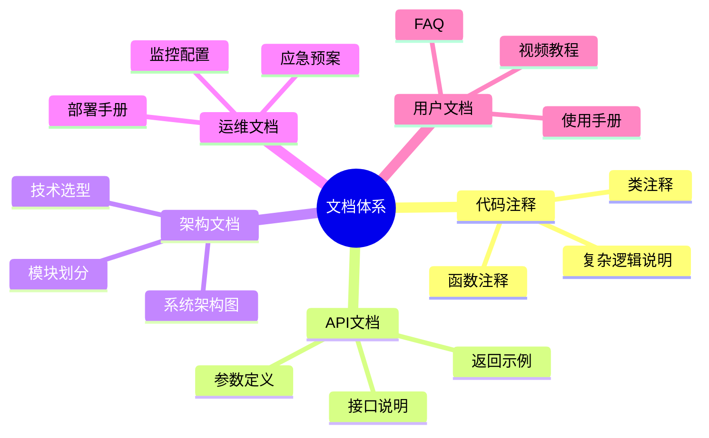

### 5.2 文档生成流程

#### 📝 角色：全能助手 + 可视化专家
**流程图**：
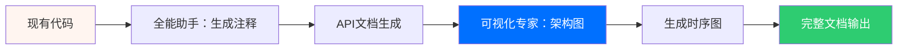

**使用提示词**：
1. **全能助手** → `遗留代码理解`（生成注释）
2. **可视化专家** → `架构图与流程图`、`时序图生成`
3. **架构师** → `C4架构图`

---

## 6. 稳定运行：运维监控

### 6.1 运维体系

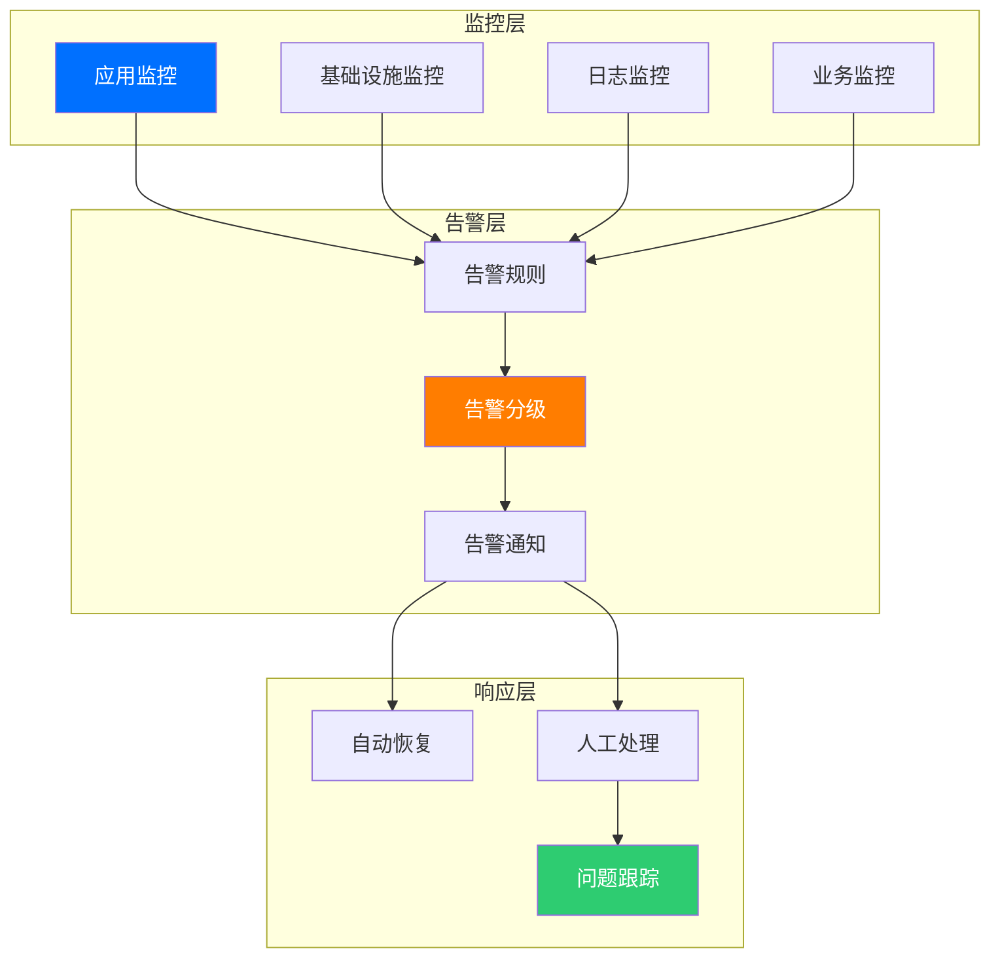

### 6.2 运维流程

#### 🚀 角色：运维工程师 + 运维组长 + 研发总监
**流程图**：
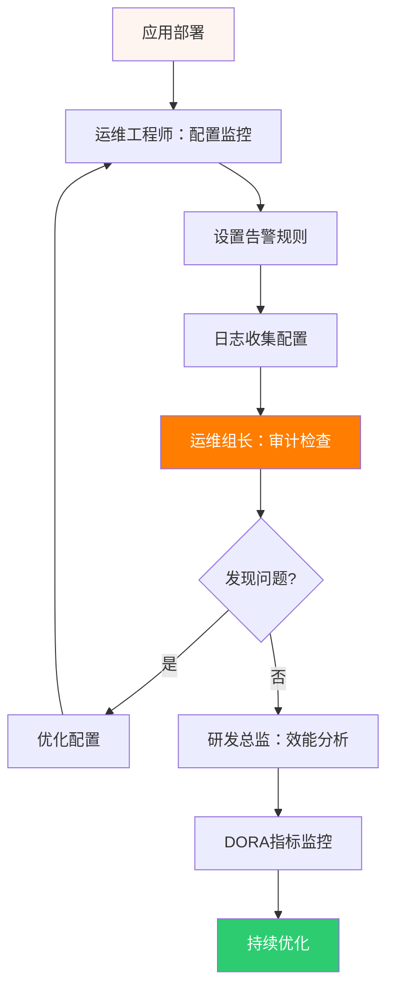

**使用提示词**：
1. **运维工程师** → `自动化部署`、`CI/CD流水线`
2. **运维组长** → `K8s审计`、`成本优化`
3. **研发总监** → `效能扫描`、`DORA指标`

---

## 7. 问题修复：Bug处理

### 7.1 Bug生命周期

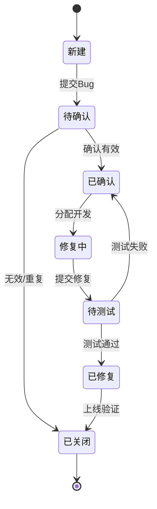

### 7.2 Bug处理流程

#### 🐛 角色：全能助手 + 测试工程师 + 开发者
**流程图**：
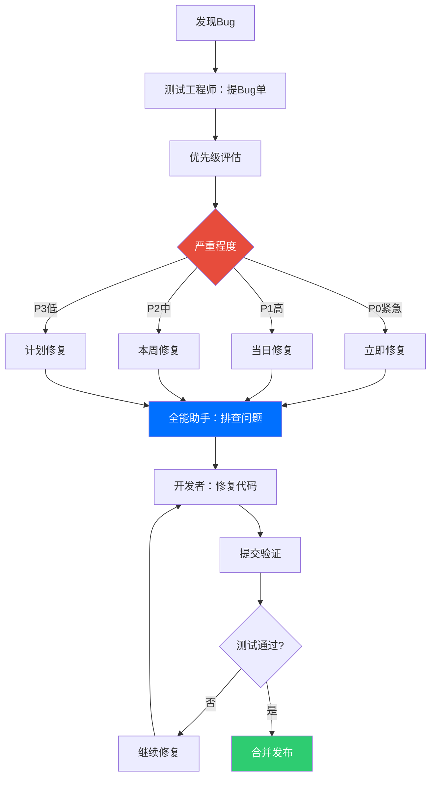

**使用提示词**：
1. **全能助手** → `报错排查`场景
2. **红队挑战者** → `盲点挖掘`（预防Bug）

---

## 8. 性能优化：持续改进

### 8.1 性能优化金字塔

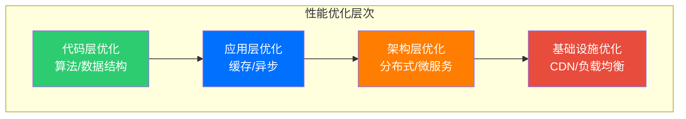

### 8.2 优化流程

#### ⚡ 角色：前端组长 + 后端组长 + 安全专家
**流程图**：
```mermaid
flowchart TB
    A[性能问题发现] --> B[前端组长：前端性能分析]
    B --> C[后端组长：后端性能分析]
    C --> D[安全专家：并发审计]
    D --> E{性能瓶颈}
    E -->|前端| F[前端优化]
    E -->|后端| G[后端优化]
    E -->|数据库| H[SQL优化]
    E -->|架构| I[架构调整]
    F & G & H & I --> J[性能测试]
    J --> K{达标?}
    K -->|否| L[继续优化]
    L --> E
    K -->|是| M[上线验证]
    
    style D fill:#e74c3c,color:#fff
    style K fill:#0070ff,color:#fff
    style M fill:#2ecc71,color:#fff
```

**使用提示词**：
1. **前端组长** → `性能优化`场景
2. **后端组长** → `架构决策`场景
3. **安全专家** → `性能分析`、`并发审计`

---

## 🎯 流程应用矩阵

| 场景 | 关键角色 | 核心流程 | 输出物 |
|-----|---------|---------|--------|
| **新项目开发** | 产品经理、架构师、项目经理 | 需求→设计→开发→测试→部署 | PRD、架构图、代码、测试报告 |
| **二次开发** | 全能助手、产品总监、开发者 | 代码理解→需求评审→迭代开发 | 分析报告、更新文档、新功能 |
| **Bug修复** | 全能助手、测试工程师、开发者 | 问题排查→修复→验证→发布 | Bug报告、修复代码、回归测试 |
| **安全审计** | 安全专家、运维组长 | 扫描→审计→修复→验证 | 安全报告、修复方案 |
| **文档完善** | 全能助手、可视化专家 | 代码分析→文档生成→图表绘制 | 注释、API文档、架构图 |
| **性能优化** | 前端组长、后端组长、安全专家 | 分析→优化→测试→验证 | 性能报告、优化方案 |
| **运维监控** | 运维工程师、运维组长、研发总监 | 监控配置→告警→响应→优化 | 监控方案、运维手册 |
| **持续交付** | 运维工程师、项目经理 | 构建→测试→部署→验证 | CI/CD配置、部署文档 |

---

## 📚 最佳实践建议

### 1. 需求阶段
- ✅ 使用**产品经理**拆解复杂需求为用户故事
- ✅ 通过**产品总监**进行PRD评审，确保需求合理性
- ✅ 利用**可视化专家**绘制原型流程图

### 2. 设计阶段
- ✅ 让**架构师**进行全链路扫描，识别潜在风险
- ✅ 使用**可视化专家**生成C4架构图和时序图
- ✅ 通过**UI/UX设计师**快速输出高保真原型

### 3. 开发阶段
- ✅ 使用**全能助手**理解遗留代码
- ✅ 让**前端/后端组长**进行代码审查
- ✅ 通过**项目经理**跟踪进度和风险

### 4. 测试阶段
- ✅ 使用**测试工程师**生成自动化测试用例
- ✅ 让**安全专家**进行安全扫描
- ✅ 通过**红队挑战者**挖掘潜在问题

### 5. 部署阶段
- ✅ 使用**运维工程师**配置CI/CD流水线
- ✅ 让**运维组长**进行K8s审计
- ✅ 通过**研发总监**监控DORA指标

### 6. 运维阶段
- ✅ 配置完善的监控告警系统
- ✅ 建立问题响应机制
- ✅ 定期进行性能优化

---

## 🔄 敏捷迭代流程

```mermaid
graph LR
    A[Sprint规划] --> B[每日站会]
    B --> C[开发]
    C --> D[代码审查]
    D --> E[测试]
    E --> F[Sprint评审]
    F --> G[Sprint回顾]
    G --> A
    
    style A fill:#FF7D00,color:#fff
    style F fill:#0070ff,color:#fff
    style G fill:#2ecc71,color:#fff
```

**每个Sprint周期（2周）**：
1. **Sprint规划会**（2小时）- 项目经理主持
2. **每日站会**（15分钟）- 同步进度
3. **开发+测试**（8-9天）- 并行进行
4. **Sprint评审**（1小时）- 产品验收
5. **Sprint回顾**（1小时）- 总结改进

---

## 📊 质量门禁标准

| 阶段 | 门禁条件 | 检查工具 | 负责角色 |
|-----|---------|---------|---------|
| **代码提交** | 单元测试覆盖率>80% | JUnit/Jest | 开发者 |
| **代码合并** | Code Review通过 | GitLab MR | 技术组长 |
| **集成测试** | 自动化测试通过率>95% | Selenium/Cypress | 测试工程师 |
| **安全扫描** | 无高危漏洞 | SonarQube/SAST | 安全专家 |
| **性能测试** | 响应时间<200ms | JMeter/k6 | 测试工程师 |
| **上线审批** | 所有门禁通过 | 人工审批 | 研发总监 |

---

## 🎓 相关资源

### 提示词文档
- [产品经理](./product-manager.md) - 需求拆解、用户故事
- [架构师](./architect.md) - 架构设计、技术选型
- [可视化专家](./visualization-expert.md) - 图表生成、动画演示
- [前端开发](./frontend-developer.md) - 组件开发
- [后端开发](./backend-developer.md) - API设计
- [测试工程师](./qa-engineer.md) - 测试用例生成
- [安全专家](./security-expert.md) - 安全扫描
- [运维工程师](./devops-engineer.md) - 自动化部署
- [项目经理](./project-manager.md) - 进度管理

### 角色卡片
- [查看所有角色](./role-cards.html) - 18个SDLC智能助手

---

**版本**：v1.0  
**最后更新**：2025-01-07  
**维护者**：SDLC AI Agent Team
