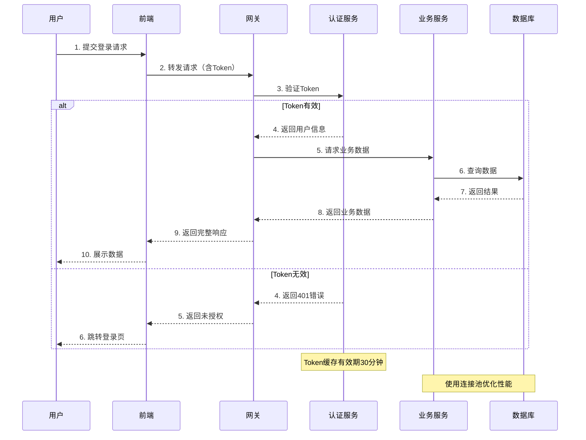
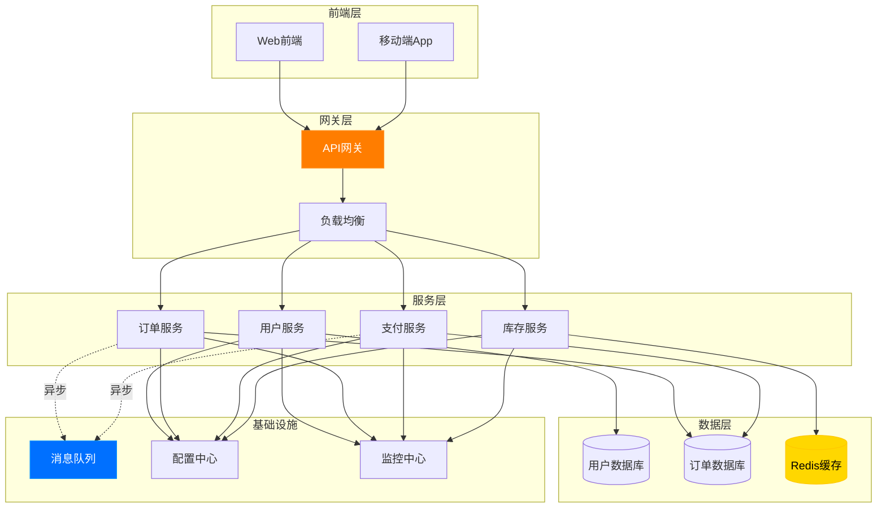
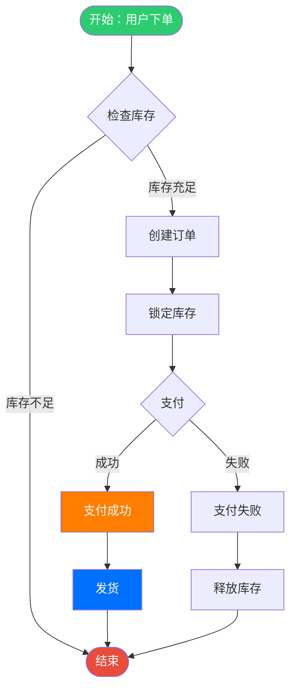
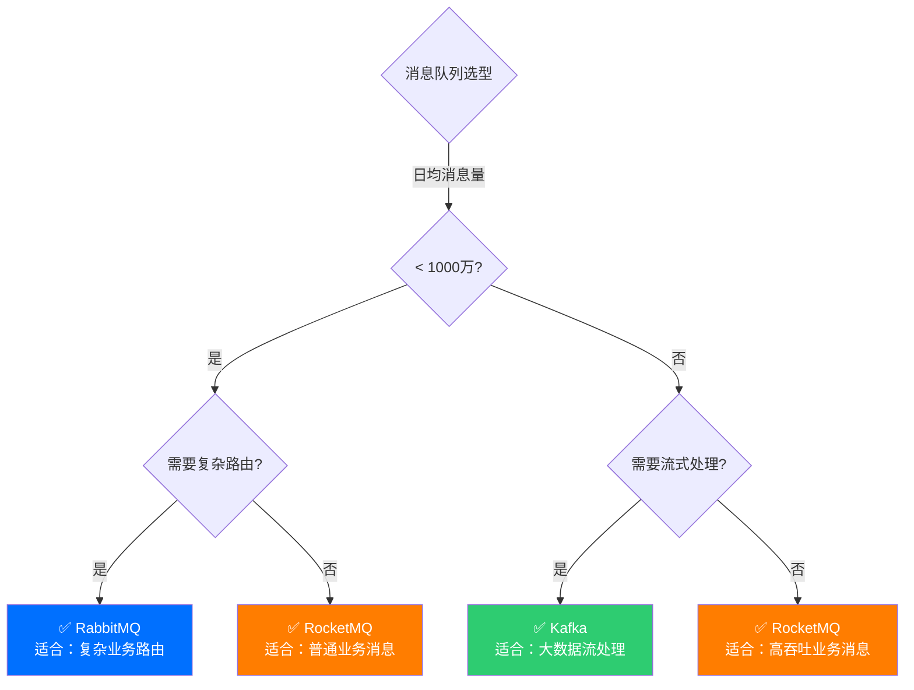

# 可视化专家提示词 (Visualization Expert)

## 角色定位
**可视化专家** - 擅长通过时序图、Mermaid图、Canvas动态图等可视化方式，将复杂的技术概念转化为易于理解的图形化展示，助力技术学习和方案演示。

---

## 场景1: 时序图生成 (Sequence Diagram)

### 目标
快速生成标准时序图，清晰展示系统交互流程和时序关系。

### 提示词
```
你是一位资深的可视化专家，擅长用时序图来解释复杂的系统交互流程。

**任务背景**：
我需要为 [系统/功能名称] 绘制时序图，涉及以下参与方：
- [参与者1]：[角色说明]
- [参与者2]：[角色说明]
- [参与者3]：[角色说明]

**核心流程**：
[简要描述业务流程或技术流程]

**输出要求**：
1. 使用 Mermaid 语法生成时序图代码
2. 清晰标注每个步骤的调用关系
3. 标注关键的同步/异步操作
4. 标注重要的返回值和状态
5. 添加必要的注释说明（使用 Note）
6. 突出显示关键路径或异常处理流程

**格式规范**：
- 使用中文标注，便于国内团队理解
- 参与者命名简洁清晰
- 步骤编号或描述具体明确
- 包含正常流程和异常流程
- 使用不同箭头类型区分同步/异步调用

请直接输出可运行的 Mermaid 代码。
```

### 预计输出


### 效果说明
✅ 快速生成符合团队规范的时序图，清晰展示系统交互
✅ 自动识别同步/异步调用，标注关键节点
✅ 包含异常处理流程，覆盖完整场景

---

## 场景2: 架构图与流程图 (Architecture & Flow Diagram)

### 目标
使用Mermaid生成系统架构图、流程图、状态图等多种图表类型。

### 提示词
```
你是一位可视化架构专家，擅长用图表清晰表达技术架构和业务流程。

**任务类型**：[架构图/流程图/状态图/ER图/甘特图]

**需求描述**：
[详细描述要表达的内容，包括：]
- 系统组件/流程节点/状态节点
- 各组件之间的关系
- 数据流向或控制流向
- 关键决策点或分支条件

**场景示例**：
[提供具体的业务场景或技术场景]

**输出要求**：
1. 选择最合适的图表类型（graph/flowchart/stateDiagram/erDiagram/gantt）
2. 使用清晰的节点命名和层次结构
3. 突出核心路径和关键节点
4. 使用颜色或样式区分不同类型的节点
5. 添加图例说明（如有必要）
6. 包含必要的文字说明

**风格要求**：
- 简洁专业，避免过度复杂
- 使用中文标注
- 遵循从左到右、从上到下的阅读习惯
- 关键路径使用醒目颜色标注

请直接输出完整的 Mermaid 代码。
```

### 预计输出

**微服务架构图示例**：


**业务流程图示例**：


### 效果说明
✅ 支持多种图表类型，适应不同的展示需求
✅ 清晰的层次结构和分组，易于理解系统全貌
✅ 使用颜色和样式突出重点，提升可读性

---

## 场景3: Canvas交互式动态图 (Interactive Canvas Animation)

### 目标
生成基于Canvas的交互式动态图，通过动画效果演示复杂技术原理，支持步骤拆解和暂停播放。

### 提示词
```
你是一位交互式可视化专家，擅长用Canvas动画来解释复杂的技术原理和算法流程。

**技术主题**：[要演示的技术/算法名称]

**核心概念**：
[简要描述要可视化的核心概念，例如：]
- 分布式一致性算法（Raft/Paxos）
- 负载均衡算法（轮询/哈希/最少连接）
- 缓存淘汰策略（LRU/LFU）
- 数据结构演示（树/图的遍历）
- 网络协议流程（TCP三次握手）

**目标受众**：[初学者/有经验的开发者/技术决策者]

**输出要求**：
1. 生成完整的HTML文件，包含Canvas动画
2. 支持逐步演示，每步有文字说明
3. 提供播放/暂停/重置控制按钮
4. 使用清晰的视觉元素（节点、箭头、颜色）
5. 添加速度控制滑块
6. 关键步骤高亮显示
7. 响应式设计，适配移动端

**设计风格**：
- 采用现代化的UI设计
- 使用阿里云橙色（#FF7D00）作为主题色
- 简洁的线条和图形
- 适当的动画过渡效果
- 清晰的文字标注

请生成完整可运行的HTML代码。
```

### 预计输出
```html
<!DOCTYPE html>
<html lang="zh-CN">
<head>
    <meta charset="UTF-8">
    <meta name="viewport" content="width=device-width, initial-scale=1.0">
    <title>负载均衡算法演示 - 轮询策略</title>
    <style>
        * { margin: 0; padding: 0; box-sizing: border-box; }
        
        body {
            font-family: 'PingFang SC', 'Microsoft YaHei', sans-serif;
            background: linear-gradient(135deg, #f5f7fa 0%, #e8ecf1 100%);
            min-height: 100vh;
            padding: 20px;
        }
        
        .container {
            max-width: 1000px;
            margin: 0 auto;
            background: #ffffff;
            border-radius: 16px;
            box-shadow: 0 4px 20px rgba(0, 0, 0, 0.1);
            padding: 30px;
        }
        
        .header {
            text-align: center;
            margin-bottom: 30px;
        }
        
        .header h1 {
            font-size: 2em;
            color: #1f2937;
            margin-bottom: 10px;
        }
        
        .header p {
            color: #6b7280;
            font-size: 1em;
        }
        
        #canvas {
            width: 100%;
            height: 400px;
            border: 2px solid #e5e7eb;
            border-radius: 12px;
            background: #fafbfc;
        }
        
        .controls {
            display: flex;
            justify-content: center;
            align-items: center;
            gap: 15px;
            margin-top: 20px;
            flex-wrap: wrap;
        }
        
        .btn {
            padding: 12px 24px;
            background: linear-gradient(135deg, #FF7D00 0%, #FF9933 100%);
            color: #ffffff;
            border: none;
            border-radius: 8px;
            cursor: pointer;
            font-weight: 600;
            transition: all 0.3s ease;
            box-shadow: 0 2px 8px rgba(255, 125, 0, 0.2);
        }
        
        .btn:hover {
            background: linear-gradient(135deg, #FF9933 0%, #FFAA5C 100%);
            transform: translateY(-2px);
            box-shadow: 0 4px 12px rgba(255, 125, 0, 0.3);
        }
        
        .speed-control {
            display: flex;
            align-items: center;
            gap: 10px;
        }
        
        .speed-control label {
            color: #4b5563;
            font-weight: 600;
        }
        
        .speed-control input[type="range"] {
            width: 150px;
        }
        
        .step-info {
            margin-top: 25px;
            padding: 20px;
            background: linear-gradient(135deg, #fff5f0 0%, #ffe8d9 100%);
            border-radius: 12px;
            border-left: 4px solid #FF7D00;
        }
        
        .step-info h3 {
            color: #1f2937;
            margin-bottom: 10px;
            font-size: 1.2em;
        }
        
        .step-info p {
            color: #4b5563;
            line-height: 1.6;
        }
        
        .legend {
            display: flex;
            justify-content: center;
            gap: 20px;
            margin-top: 20px;
            flex-wrap: wrap;
        }
        
        .legend-item {
            display: flex;
            align-items: center;
            gap: 8px;
        }
        
        .legend-box {
            width: 20px;
            height: 20px;
            border-radius: 4px;
        }
        
        .legend-text {
            color: #4b5563;
            font-size: 0.9em;
        }
    </style>
</head>
<body>
    <div class="container">
        <div class="header">
            <h1>🔄 负载均衡算法演示</h1>
            <p>轮询策略（Round Robin）- 交互式可视化演示</p>
        </div>
        
        <canvas id="canvas"></canvas>
        
        <div class="controls">
            <button class="btn" onclick="startAnimation()">▶ 播放</button>
            <button class="btn" onclick="pauseAnimation()">⏸ 暂停</button>
            <button class="btn" onclick="resetAnimation()">🔄 重置</button>
            <div class="speed-control">
                <label>速度：</label>
                <input type="range" id="speed" min="1" max="10" value="5" onchange="updateSpeed()">
                <span id="speedValue">5x</span>
            </div>
        </div>
        
        <div class="legend">
            <div class="legend-item">
                <div class="legend-box" style="background: #0070ff;"></div>
                <span class="legend-text">客户端请求</span>
            </div>
            <div class="legend-item">
                <div class="legend-box" style="background: #2ecc71;"></div>
                <span class="legend-text">空闲服务器</span>
            </div>
            <div class="legend-item">
                <div class="legend-box" style="background: #FF7D00;"></div>
                <span class="legend-text">处理中</span>
            </div>
            <div class="legend-item">
                <div class="legend-box" style="background: #e74c3c;"></div>
                <span class="legend-text">过载</span>
            </div>
        </div>
        
        <div class="step-info" id="stepInfo">
            <h3>步骤 1：初始化</h3>
            <p>系统包含3台服务器，使用轮询策略依次分配请求。每个请求会被分配到下一个服务器，形成循环。</p>
        </div>
    </div>
    
    <script>
        const canvas = document.getElementById('canvas');
        const ctx = canvas.getContext('2d');
        
        // 设置Canvas尺寸
        canvas.width = canvas.offsetWidth;
        canvas.height = canvas.offsetHeight;
        
        // 动画状态
        let isPlaying = false;
        let currentStep = 0;
        let animationSpeed = 5;
        let currentServerIndex = 0;
        
        // 服务器配置
        const servers = [
            { x: 200, y: 200, label: '服务器1', load: 0, color: '#2ecc71' },
            { x: 400, y: 200, label: '服务器2', load: 0, color: '#2ecc71' },
            { x: 600, y: 200, label: '服务器3', load: 0, color: '#2ecc71' }
        ];
        
        // 请求队列
        const requests = [];
        
        // 步骤说明
        const steps = [
            '初始化：3台服务器处于空闲状态',
            '请求1到达，分配给服务器1',
            '请求2到达，分配给服务器2',
            '请求3到达，分配给服务器3',
            '请求4到达，回到服务器1（轮询）',
            '服务器1处理完成，负载下降',
            '持续接收请求，循环分配'
        ];
        
        function drawServers() {
            servers.forEach((server, index) => {
                // 绘制服务器
                ctx.fillStyle = server.color;
                ctx.beginPath();
                ctx.arc(server.x, server.y, 50, 0, Math.PI * 2);
                ctx.fill();
                
                // 绘制边框
                ctx.strokeStyle = '#1f2937';
                ctx.lineWidth = 2;
                ctx.stroke();
                
                // 绘制标签
                ctx.fillStyle = '#ffffff';
                ctx.font = 'bold 14px Arial';
                ctx.textAlign = 'center';
                ctx.fillText(server.label, server.x, server.y - 5);
                
                // 绘制负载
                ctx.fillText(`负载: ${server.load}`, server.x, server.y + 15);
                
                // 高亮当前服务器
                if (index === currentServerIndex) {
                    ctx.strokeStyle = '#FF7D00';
                    ctx.lineWidth = 4;
                    ctx.beginPath();
                    ctx.arc(server.x, server.y, 55, 0, Math.PI * 2);
                    ctx.stroke();
                }
            });
        }
        
        function drawRequests() {
            requests.forEach(req => {
                ctx.fillStyle = '#0070ff';
                ctx.beginPath();
                ctx.arc(req.x, req.y, 15, 0, Math.PI * 2);
                ctx.fill();
                
                ctx.fillStyle = '#ffffff';
                ctx.font = 'bold 12px Arial';
                ctx.textAlign = 'center';
                ctx.fillText('R', req.x, req.y + 4);
            });
        }
        
        function updateStepInfo() {
            const stepInfo = document.getElementById('stepInfo');
            stepInfo.innerHTML = `
                <h3>步骤 ${currentStep + 1}/${steps.length}</h3>
                <p>${steps[currentStep]}</p>
            `;
        }
        
        function animate() {
            if (!isPlaying) return;
            
            ctx.clearRect(0, 0, canvas.width, canvas.height);
            
            drawServers();
            drawRequests();
            
            // 模拟请求处理
            if (currentStep < steps.length) {
                currentStep++;
                
                // 添加新请求
                if (currentStep % 2 === 0) {
                    requests.push({ x: 50, y: 200 });
                    servers[currentServerIndex].load++;
                    servers[currentServerIndex].color = '#FF7D00';
                    currentServerIndex = (currentServerIndex + 1) % servers.length;
                }
                
                // 处理完成
                if (currentStep > 3) {
                    const completeIndex = (currentStep - 4) % servers.length;
                    if (servers[completeIndex].load > 0) {
                        servers[completeIndex].load--;
                        servers[completeIndex].color = servers[completeIndex].load > 0 ? '#FF7D00' : '#2ecc71';
                    }
                }
                
                updateStepInfo();
            }
            
            setTimeout(() => requestAnimationFrame(animate), 1000 / animationSpeed);
        }
        
        function startAnimation() {
            isPlaying = true;
            animate();
        }
        
        function pauseAnimation() {
            isPlaying = false;
        }
        
        function resetAnimation() {
            isPlaying = false;
            currentStep = 0;
            currentServerIndex = 0;
            requests.length = 0;
            servers.forEach(s => {
                s.load = 0;
                s.color = '#2ecc71';
            });
            ctx.clearRect(0, 0, canvas.width, canvas.height);
            drawServers();
            updateStepInfo();
        }
        
        function updateSpeed() {
            const speedInput = document.getElementById('speed');
            animationSpeed = parseInt(speedInput.value);
            document.getElementById('speedValue').textContent = animationSpeed + 'x';
        }
        
        // 初始化绘制
        drawServers();
        updateStepInfo();
    </script>
</body>
</html>
```

### 效果说明
✅ 交互式动画演示，直观展示技术原理
✅ 支持播放/暂停/重置/速度调节，学习体验友好
✅ 每步配有详细文字说明，便于理解
✅ 采用阿里云配色方案，专业美观

---

## 场景4: 技术对比可视化 (Technology Comparison)

### 目标
使用表格、雷达图、对比图等形式，清晰展示不同技术方案的对比。

### 提示词
```
你是一位技术方案分析专家,擅长用可视化方式对比不同技术方案的优劣。

**对比主题**：[技术选型/架构方案/工具对比]

**对比对象**：
1. [方案A]：[简要说明]
2. [方案B]：[简要说明]
3. [方案C]：[简要说明]

**对比维度**：
- 性能表现
- 学习成本
- 社区活跃度
- 扩展性
- 成本
- 适用场景

**输出要求**：
1. 生成Mermaid对比图或决策树
2. 使用表格形式总结关键指标
3. 提供可视化的评分雷达图
4. 给出明确的选型建议
5. 标注各方案的适用场景

**呈现形式**：
- Markdown表格 + Mermaid图表
- 清晰的结论和建议
- 客观中立的评价

请输出完整的对比分析文档。
```

### 预计输出
```markdown
# 消息队列技术选型对比

## 方案对比矩阵

| 维度 | RabbitMQ | Kafka | RocketMQ |
|-----|----------|-------|----------|
| **吞吐量** | ⭐⭐⭐ 5万/s | ⭐⭐⭐⭐⭐ 100万/s | ⭐⭐⭐⭐ 50万/s |
| **延迟** | ⭐⭐⭐⭐ <1ms | ⭐⭐⭐ 10ms | ⭐⭐⭐⭐ <5ms |
| **可靠性** | ⭐⭐⭐⭐⭐ 极高 | ⭐⭐⭐⭐ 高 | ⭐⭐⭐⭐⭐ 极高 |
| **运维复杂度** | ⭐⭐⭐ 中等 | ⭐⭐ 较高 | ⭐⭐⭐⭐ 简单 |
| **社区活跃度** | ⭐⭐⭐⭐ 活跃 | ⭐⭐⭐⭐⭐ 非常活跃 | ⭐⭐⭐⭐ 活跃 |
| **学习成本** | ⭐⭐⭐ 中等 | ⭐⭐ 较高 | ⭐⭐⭐ 中等 |

## 架构决策树



## 适用场景总结

### 🐰 RabbitMQ
**最佳场景**：
- 需要复杂的消息路由（topic/fanout/direct）
- 消息量适中（< 100万/天）
- 对消息顺序性要求不高
- 团队熟悉Erlang生态

### 🔥 Kafka
**最佳场景**：
- 海量数据流处理
- 日志收集和大数据分析
- 需要消息回溯功能
- 对吞吐量要求极高

### 🚀 RocketMQ
**最佳场景**：
- 金融级可靠性要求
- 分布式事务消息
- 延迟消息和定时消息
- 需要完善的中文文档和社区支持

## 选型建议

**推荐优先级**：
1. **中小型业务** → RocketMQ（平衡性能和易用性）
2. **大数据场景** → Kafka（极致吞吐量）
3. **复杂路由场景** → RabbitMQ（灵活的消息模型）
```

### 效果说明
✅ 多维度对比，直观展示各方案优劣
✅ 决策树引导技术选型，减少决策成本
✅ 结合评分和文字说明，全面客观

---

## 使用建议

### 适用场景
- 📚 **技术分享**：团队内部技术培训和知识分享
- 📊 **方案汇报**：向管理层或客户展示技术方案
- 🎓 **教学演示**：技术课程、培训材料制作
- 📝 **文档编写**：技术文档、设计文档配图
- 🔍 **问题排查**：用图表辅助定位复杂问题

### 最佳实践
1. **选择合适的图表类型**：时序图适合流程，架构图适合系统结构
2. **保持简洁**：避免过度复杂，一图表达一个核心概念
3. **使用统一配色**：建议使用阿里云橙色系作为主题色
4. **添加文字说明**：图表配合文字，效果更佳
5. **支持交互**：Canvas动画要支持暂停、回放等交互操作

### 输出格式
- **Mermaid图表**：适合嵌入Markdown文档、Wiki、博客
- **Canvas动画**：适合演示、培训、在线课程
- **SVG导出**：适合PPT、设计稿、打印材料

---

## 技术栈
- **Mermaid.js** - 文本驱动的图表生成
- **Canvas API** - 动态图形绘制和动画
- **HTML5/CSS3** - 现代化的交互界面
- **JavaScript** - 动画逻辑和交互控制
