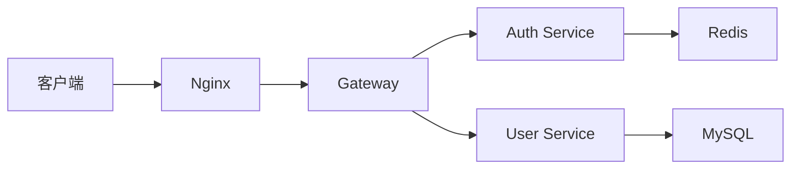
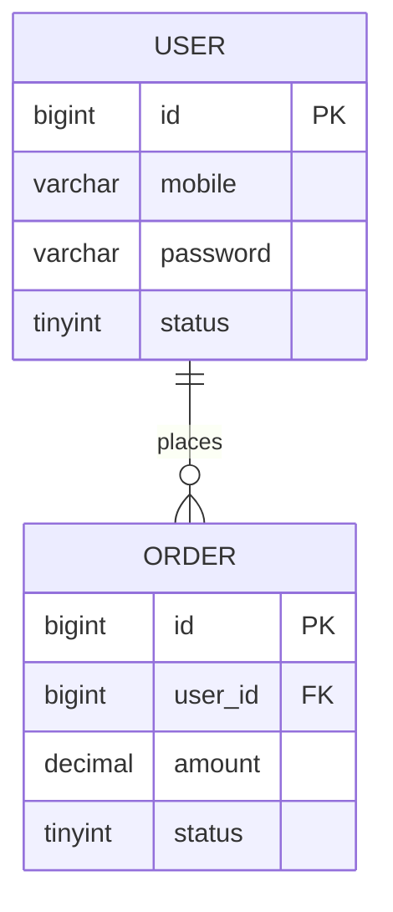

# 文档规范

## 1. 文档体系

### 1.1 文档分类
```
文档体系
├── 产品文档
│   ├── PRD（产品需求文档）
│   ├── 用户手册
│   └── 操作指南
├── 技术文档
│   ├── 架构设计文档
│   ├── 详细设计文档
│   ├── 接口文档
│   └── 数据库设计文档
├── 开发文档
│   ├── 开发规范
│   ├── 代码注释
│   └── README
└── 运维文档
    ├── 部署文档
    ├── 运维手册
    └── 故障处理手册
```

## 2. PRD（产品需求文档）

### 2.1 文档结构
```markdown
# [项目名称] 产品需求文档

## 1. 文档信息
- 版本：V1.0
- 作者：张三
- 创建日期：2024-01-15
- 更新日期：2024-01-20

## 2. 修订历史
| 版本 | 日期 | 作者 | 修改内容 |
|------|------|------|----------|
| V1.0 | 2024-01-15 | 张三 | 初始版本 |
| V1.1 | 2024-01-20 | 张三 | 新增积分功能 |

## 3. 项目背景
### 3.1 业务背景
电商业务快速增长，现有用户登录体验较差，需要优化登录流程。

### 3.2 目标用户
- C端用户：普通消费者
- B端用户：商家

### 3.3 项目目标
- 提升登录成功率至95%以上
- 缩短登录时间至3秒以内
- 支持多种登录方式

## 4. 功能需求

### 4.1 功能列表
| 功能模块 | 优先级 | 状态 |
|----------|--------|------|
| 手机号登录 | P0 | 待开发 |
| 验证码登录 | P0 | 待开发 |
| 微信登录 | P1 | 待开发 |
| 忘记密码 | P1 | 待开发 |

### 4.2 功能详细设计

#### 4.2.1 手机号+密码登录
**用户故事**：作为用户，我希望通过手机号+密码登录，以便快速访问系统。

**前置条件**：
- 用户已注册

**操作流程**：
1. 用户打开登录页面
2. 输入手机号和密码
3. 点击"登录"按钮
4. 系统验证手机号和密码
5. 验证成功，跳转到首页

**业务规则**：
- 手机号格式：1开头，11位数字
- 密码长度：6-20位，包含字母和数字
- 连续5次密码错误，账号锁定30分钟

**UI原型**：
[插入原型图]

**验收标准**：
- [ ] 支持手机号+密码登录
- [ ] 密码错误有友好提示
- [ ] 连续错误5次账号锁定

## 5. 非功能需求

### 5.1 性能需求
- 登录接口响应时间：P95 < 500ms
- 支持并发：5000 QPS

### 5.2 安全需求
- 密码加密存储（BCrypt）
- 传输加密（HTTPS）
- 防暴力破解（验证码 + 限流）

### 5.3 兼容性需求
- 浏览器：Chrome、Safari、Edge最新版
- 移动端：iOS 12+、Android 8+

## 6. 上线计划
- 开发时间：2周
- 测试时间：1周
- 上线日期：2024-02-15

## 7. 风险与依赖
- 短信服务依赖第三方（阿里云）
- 微信登录依赖微信开放平台审核
```

## 3. 技术方案文档

### 3.1 架构设计文档
```markdown
# 用户登录系统 架构设计文档

## 1. 系统概述
### 1.1 背景
xxx

### 1.2 目标
- 高可用：99.9%
- 高性能：P95 < 500ms
- 可扩展：支持水平扩展

## 2. 架构设计

### 2.1 总体架构


### 2.2 技术选型
| 组件 | 技术 | 版本 | 说明 |
|------|------|------|------|
| 网关 | Spring Cloud Gateway | 3.1.0 | API网关 |
| 认证 | Spring Security + JWT | 5.8.0 | 认证授权 |
| 缓存 | Redis | 7.0 | Token缓存 |
| 数据库 | MySQL | 8.0 | 用户数据 |

### 2.3 核心流程

#### 登录流程
1. 用户提交手机号+密码
2. 网关转发到Auth Service
3. 查询MySQL验证密码
4. 生成JWT Token
5. Token存入Redis
6. 返回Token给客户端

### 2.4 数据库设计
```sql
CREATE TABLE `ums_user` (
  `id` BIGINT UNSIGNED NOT NULL AUTO_INCREMENT,
  `mobile` VARCHAR(11) NOT NULL COMMENT '手机号',
  `password` VARCHAR(64) NOT NULL COMMENT '密码',
  `status` TINYINT NOT NULL DEFAULT 1 COMMENT '状态(1-正常 2-锁定)',
  PRIMARY KEY (`id`),
  UNIQUE KEY `uk_mobile` (`mobile`)
);
```

## 3. 性能设计
### 3.1 缓存策略
- Token缓存：Redis，过期时间2小时
- 用户信息缓存：Redis，过期时间30分钟

### 3.2 限流策略
- 登录接口：单IP限流100次/分钟
- 短信验证码：单手机号限流5次/天

## 4. 安全设计
### 4.1 密码安全
- 使用BCrypt加密
- 密码强度校验

### 4.2 传输安全
- 强制HTTPS
- Token签名验证

## 5. 监控告警
- 登录成功率 < 95% 告警
- 接口响应时间 > 1s 告警
- Redis连接异常告警

## 6. 部署方案
- Docker容器化部署
- K8s编排管理
- 最少3个实例
```

## 4. 接口文档

### 4.1 Swagger文档
```java
@Api(tags = "用户认证")
@RestController
@RequestMapping("/api/v1/auth")
public class AuthController {

    @ApiOperation("用户登录")
    @ApiImplicitParams({
        @ApiImplicitParam(name = "mobile", value = "手机号", required = true),
        @ApiImplicitParam(name = "password", value = "密码", required = true)
    })
    @ApiResponses({
        @ApiResponse(code = 200, message = "登录成功"),
        @ApiResponse(code = 40001, message = "用户名或密码错误"),
        @ApiResponse(code = 40002, message = "账号已锁定")
    })
    @PostMapping("/login")
    public Result<LoginVO> login(@RequestBody LoginDTO dto) {
        // ...
    }
}
```

### 4.2 接口文档模板
```markdown
## 用户登录

### 基本信息
- 接口地址：`POST /api/v1/auth/login`
- 接口说明：用户通过手机号+密码登录

### 请求参数
| 参数名 | 类型 | 必填 | 说明 | 示例 |
|--------|------|------|------|------|
| mobile | String | 是 | 手机号 | 13812345678 |
| password | String | 是 | 密码 | abc123 |

### 请求示例
```json
{
  "mobile": "13812345678",
  "password": "abc123"
}
```

### 响应参数
| 参数名 | 类型 | 说明 |
|--------|------|------|
| code | Integer | 状态码 |
| message | String | 提示信息 |
| data | Object | 数据 |
| data.token | String | JWT Token |
| data.userId | Long | 用户ID |
| data.username | String | 用户名 |

### 响应示例
```json
{
  "code": 200,
  "message": "success",
  "data": {
    "token": "eyJhbGciOiJIUzI1NiIsInR5cCI6IkpXVCJ9...",
    "userId": 123,
    "username": "张三"
  }
}
```

### 错误码
| 错误码 | 说明 |
|--------|------|
| 40001 | 用户名或密码错误 |
| 40002 | 账号已锁定 |
| 40003 | 验证码错误 |
```

## 5. 数据库设计文档

### 5.1 ER图


### 5.2 表设计文档
```markdown
## 用户表（ums_user）

### 表说明
存储用户基础信息

### 字段设计
| 字段名 | 类型 | 长度 | 默认值 | 说明 |
|--------|------|------|--------|------|
| id | BIGINT | - | 自增 | 主键 |
| mobile | VARCHAR | 11 | - | 手机号，唯一索引 |
| password | VARCHAR | 64 | - | 密码，BCrypt加密 |
| username | VARCHAR | 32 | '' | 用户名 |
| avatar | VARCHAR | 255 | '' | 头像URL |
| status | TINYINT | - | 1 | 状态：1-正常 2-锁定 |
| create_time | DATETIME | - | NOW() | 创建时间 |
| update_time | DATETIME | - | NOW() | 更新时间 |

### 索引设计
| 索引名 | 类型 | 字段 | 说明 |
|--------|------|------|------|
| PRIMARY | 主键 | id | 主键索引 |
| uk_mobile | 唯一索引 | mobile | 手机号唯一 |
| idx_create_time | 普通索引 | create_time | 按时间查询 |

### 数据量预估
- 当前：100万
- 1年后：500万
```

## 6. README文档

### 6.1 项目README模板
```markdown
# 电商用户服务

## 项目简介
电商平台的用户服务，负责用户注册、登录、信息管理等功能。

## 技术栈
- Java 17
- Spring Boot 3.0
- MyBatis Plus 3.5
- Redis 7.0
- MySQL 8.0

## 快速开始

### 环境要求
- JDK 17+
- Maven 3.8+
- MySQL 8.0+
- Redis 7.0+

### 启动步骤
1. 克隆代码
```bash
git clone https://github.com/example/user-service.git
cd user-service
```

2. 配置数据库
```bash
# 创建数据库
mysql -u root -p
CREATE DATABASE mall DEFAULT CHARSET utf8mb4;

# 导入表结构
mysql -u root -p mall < docs/sql/schema.sql
```

3. 修改配置
```yaml
# src/main/resources/application-dev.yml
spring:
  datasource:
    url: jdbc:mysql://localhost:3306/mall
    username: root
    password: your_password
```

4. 启动服务
```bash
mvn spring-boot:run
```

5. 访问接口文档
http://localhost:8080/swagger-ui.html

## 项目结构
```
user-service/
├── src/main/java/
│   └── com/example/user/
│       ├── controller/     # 控制器
│       ├── service/        # 业务逻辑
│       ├── mapper/         # 数据访问
│       └── model/          # 数据模型
├── src/main/resources/
│   ├── mapper/             # MyBatis XML
│   └── application.yml     # 配置文件
└── docs/
    ├── api/                # 接口文档
    └── sql/                # 数据库脚本
```

## 开发规范
详见 [开发规范文档](docs/coding-standards.md)

## 测试
```bash
# 单元测试
mvn test

# 覆盖率报告
mvn jacoco:report
```

## 部署
详见 [部署文档](docs/deployment.md)

## 常见问题
### Q1: 启动报错 "Could not create connection to database server"
A: 检查MySQL是否启动，配置是否正确

### Q2: Redis连接超时
A: 检查Redis是否启动，防火墙是否开放端口

## 贡献指南
1. Fork本仓库
2. 创建特性分支 (`git checkout -b feature/AmazingFeature`)
3. 提交代码 (`git commit -m 'Add some AmazingFeature'`)
4. 推送到分支 (`git push origin feature/AmazingFeature`)
5. 创建Pull Request

## 许可证
MIT License

## 联系方式
- 技术支持：tech@example.com
- 项目负责人：张三（zhangsan@example.com）
```

## 7. 运维文档

### 7.1 部署文档
```markdown
# 用户服务部署文档

## 1. 环境准备
### 1.1 服务器配置
- CPU：4核
- 内存：8G
- 磁盘：100G
- 操作系统：CentOS 7.9

### 1.2 依赖服务
- MySQL 8.0
- Redis 7.0
- Nginx 1.20

## 2. 部署步骤

### 2.1 构建镜像
```bash
# 编译打包
mvn clean package -DskipTests

# 构建Docker镜像
docker build -t user-service:1.0.0 .
```

### 2.2 启动容器
```bash
docker-compose up -d
```

### 2.3 健康检查
```bash
# 检查服务状态
curl http://localhost:8080/actuator/health

# 预期返回
{"status":"UP"}
```

## 3. 配置说明
### 3.1 环境变量
| 变量名 | 说明 | 示例 |
|--------|------|------|
| SPRING_PROFILES_ACTIVE | 环境 | prod |
| DB_HOST | 数据库地址 | 192.168.1.100 |
| DB_PASSWORD | 数据库密码 | xxx |
| REDIS_HOST | Redis地址 | 192.168.1.101 |

## 4. 回滚方案
```bash
# 停止当前版本
docker-compose down

# 启动上一版本
docker-compose -f docker-compose-v0.9.0.yml up -d
```

## 5. 监控告警
- Prometheus：http://monitor.example.com
- Grafana：http://grafana.example.com
- 告警通知：企业微信群
```

## 8. 文档管理

### 8.1 存储位置
- **Wiki系统**：Confluence、禅道
- **代码仓库**：docs目录
- **云文档**：腾讯文档、石墨文档

### 8.2 版本管理
- **主版本号**：重大架构变更
- **次版本号**：功能新增或修改
- **修订号**：Bug修复或小改动

### 8.3 更新机制
- **定期更新**：每个迭代结束后更新
- **及时更新**：重大变更后24小时内更新
- **归档管理**：旧版本文档归档保留

## 9. 文档模板

### 9.1 变更记录模板
```markdown
## 修订历史
| 版本 | 日期 | 作者 | 变更类型 | 变更内容 |
|------|------|------|----------|----------|
| V1.0 | 2024-01-15 | 张三 | 新增 | 初始版本 |
| V1.1 | 2024-01-20 | 张三 | 修改 | 新增积分功能 |
| V1.2 | 2024-01-25 | 李四 | 修复 | 修复登录Bug |
```

## 10. 禁止事项

### 10.1 文档禁忌
- ❌ 禁止口头传达不写文档
- ❌ 禁止文档与代码不一致
- ❌ 禁止文档无版本管理
- ❌ 禁止文档无人维护
- ❌ 禁止敏感信息写入文档（密码、密钥）
