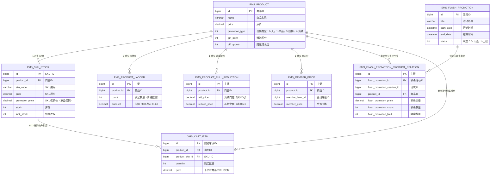

## mall 电商系统价格体系 - 数据库实体关系图

### 1. 实体概览

本图基于价格体系扫描结果，涵盖以下与价格/促销强相关的表：

- **pms_product**：商品主表，定义商品原价与促销类型。
- **pms_sku_stock**：SKU 库存与单品促销价。
- **pms_product_ladder**：按数量阶梯打折规则。
- **pms_product_full_reduction**：满减规则（满多少减多少）。
- **sms_flash_promotion**：秒杀活动主表。
- **sms_flash_promotion_product_relation**：秒杀活动与商品的关联及秒杀价。
- **pms_member_price**：不同会员等级的会员价。
- **oms_cart_item**：购物车条目，引用商品与 SKU。

### 2. ER 图（Mermaid）

### 3. 价格相关关系小结

- **商品维度（pms_product）**：作为价格体系的核心实体，所有促销规则（阶梯价、满减、会员价、秒杀关联）都通过 `product_id` 与它关联。
- **SKU 维度（pms_sku_stock）**：在商品基础上细化到 SKU，支持同一商品不同规格不同价格/促销价。
- **活动维度**：
  - 阶梯价、满减、会员价属于“商品内置规则”，直接挂在商品上。
  - 秒杀活动通过 `sms_flash_promotion_product_relation` 将活动与商品关联，并提供独立的 `flash_promotion_price`。
- **购物车维度（oms_cart_item）**：通过 `product_id` 和 `product_sku_id` 连接到商品和 SKU，是价格计算链路的入口实体之一。
