# mall电商系统 - 价格体系调用关系图

## 一、时序图（购物车价格计算完整流程）

### 1.1 购物车查询价格计算时序图

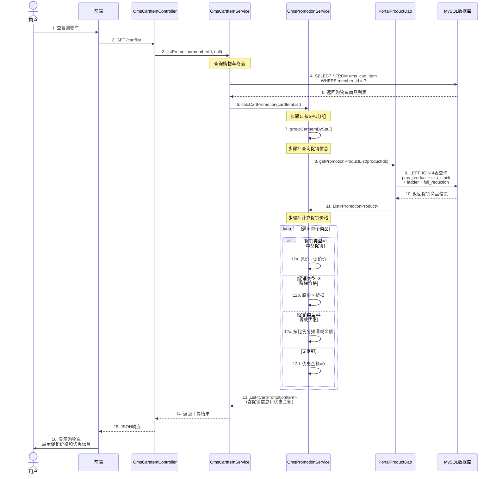

---

## 二、架构图（价格体系分层架构）

### 2.1 价格计算系统分层架构图

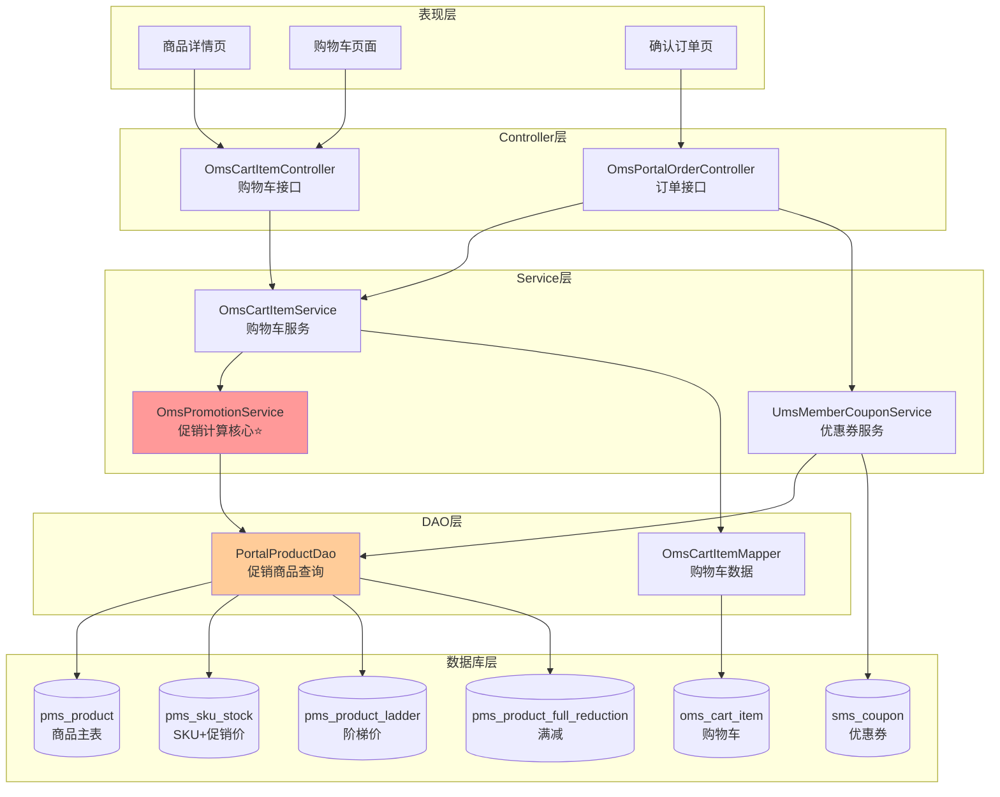

---

## 三、流程图（促销价格计算核心逻辑）

### 3.1 促销计算主流程

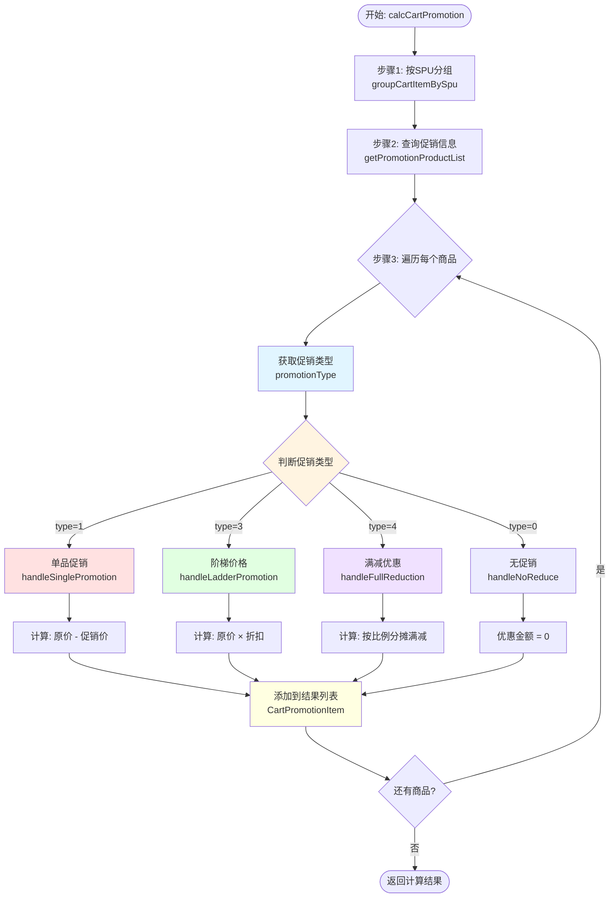

### 3.2 单品促销计算详细流程

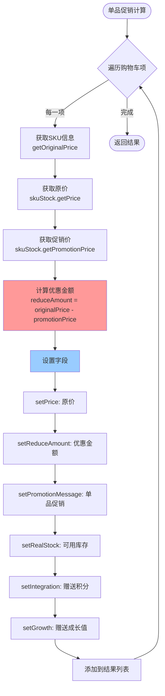

### 3.3 阶梯价格计算详细流程

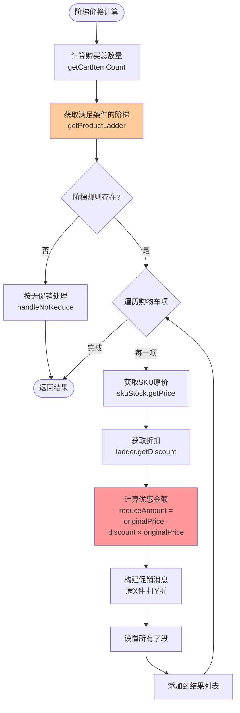

### 3.4 满减优惠计算详细流程

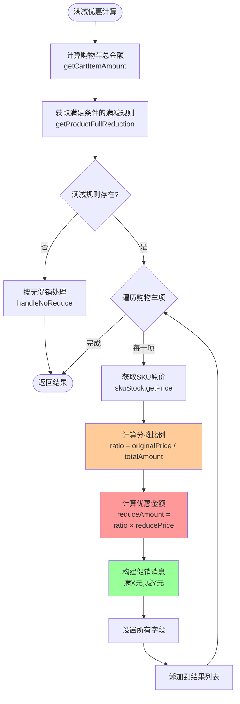

---

## 四、数据流图（价格数据流转）

### 4.1 价格数据流转图

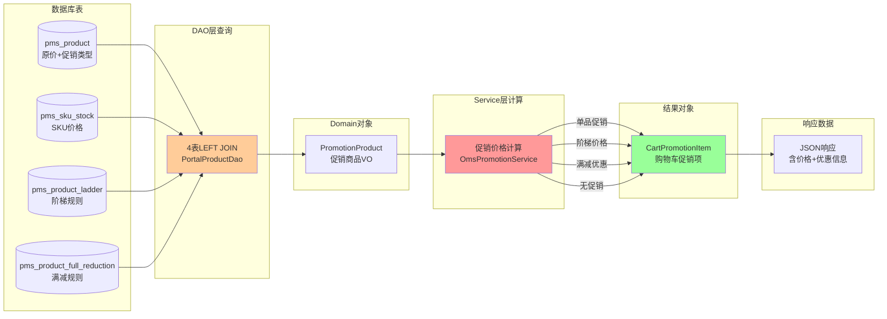

### 4.2 价格计算数据转换图

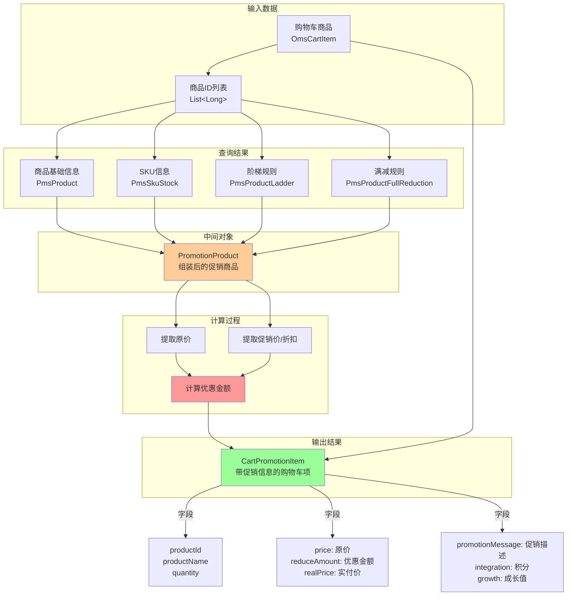

---

## 五、类图（价格体系核心类关系）

### 5.1 价格计算核心类图

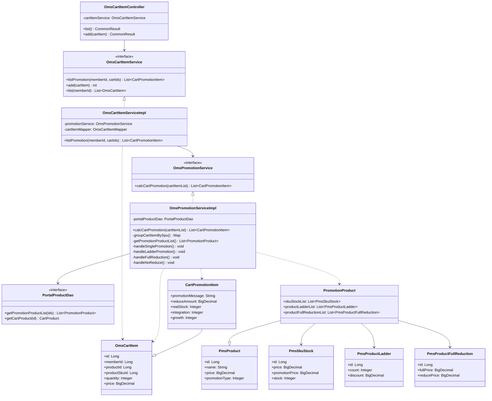

---

## 六、ER图（价格相关数据库表关系）

### 6.1 价格体系数据库ER图

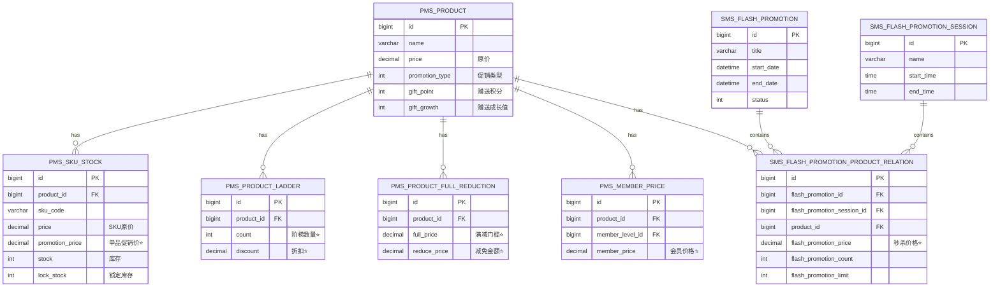

---

## 七、状态图（促销类型状态转换）

### 7.1 促销类型判断状态图

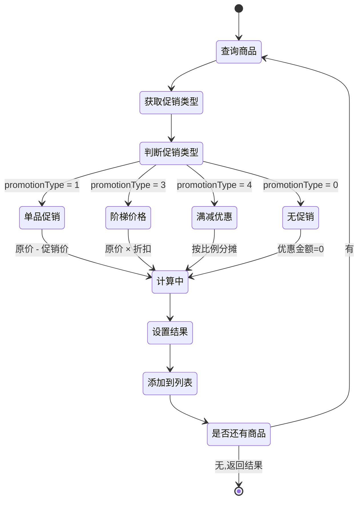

---

## 八、关键逻辑说明

### 8.1 时序图说明

**时序图展示了完整的调用时间顺序:**
1. 从用户触发到前端请求
2. Controller层接收请求
3. Service层业务处理
4. DAO层数据库查询
5. 价格计算核心逻辑
6. 结果返回到前端

**关键点:**
- 采用LEFT JOIN 4表联查,一次获取所有促销信息
- 价格计算在内存中完成,避免多次数据库交互
- 支持4种促销类型的分支处理

### 8.2 架构图说明

**架构图展示了分层设计:**
- 表现层: 多个页面触发价格计算
- Controller层: 统一入口
- Service层: 核心业务逻辑(OmsPromotionService是关键)
- DAO层: 数据访问
- 数据库层: 7张价格相关表

**设计特点:**
- 清晰的分层架构
- 促销计算服务独立,便于复用
- 数据库表职责明确

### 8.3 流程图说明

**主流程图:**
- 展示了3步核心逻辑: 分组→查询→计算
- 清晰的促销类型分支判断
- 循环处理每个商品

**详细流程图:**
- 单品促销: 直接取促销价差值
- 阶梯价格: 先匹配阶梯规则,再计算折扣
- 满减优惠: 先计算总额,再按比例分摊

### 8.4 数据流图说明

**数据流转过程:**
```
原始数据(购物车) 
  → 数据库查询(4表JOIN) 
    → 中间对象(PromotionProduct) 
      → 价格计算(促销逻辑) 
        → 结果对象(CartPromotionItem) 
          → JSON响应
```

### 8.5 类图说明

**核心类职责:**
- `OmsPromotionServiceImpl`: 促销计算核心,包含4种促销算法
- `PortalProductDao`: 数据查询,4表联查
- `CartPromotionItem`: 结果封装,继承OmsCartItem并扩展促销字段
- `PromotionProduct`: 促销商品VO,聚合SKU、阶梯、满减信息

### 8.6 ER图说明

**表关系说明:**
- `pms_product`: 1对多关系连接所有价格相关表
- `pms_sku_stock`: 存储单品促销价
- `pms_product_ladder`: 存储阶梯价规则
- `pms_product_full_reduction`: 存储满减规则
- `sms_flash_promotion_product_relation`: 关联秒杀活动和商品

**关键字段:**
- ⭐标记的字段是价格计算的核心数据

---

## 九、性能分析图

### 9.1 性能瓶颈分析

```mermaid
flowchart TD
    subgraph 性能瓶颈点
        P1[🔴 4表LEFT JOIN<br/>查询复杂度高]
        P2[🔴 无缓存机制<br/>每次都查库]
        P3[🟡 内存计算<br/>商品多时开销大]
        P4[🟡 循环遍历<br/>时间复杂度O&#40;n&#41;]
    end
    
    subgraph 优化方案
        S1[✅ 添加Redis缓存<br/>缓存促销信息]
        S2[✅ SQL优化<br/>添加索引]
        S3[✅ 批量计算<br/>减少循环次数]
        S4[✅ 异步计算<br/>大批量时异步处理]
    end
    
    P1 --> S1
    P1 --> S2
    P2 --> S1
    P3 --> S3
    P4 --> S3
    P4 --> S4
    
    style P1 fill:#ff9999
    style P2 fill:#ff9999
    style P3 fill:#ffcc99
    style P4 fill:#ffcc99
    style S1 fill:#99ff99
    style S2 fill:#99ff99
    style S3 fill:#99ff99
    style S4 fill:#99ff99
```

---

## 十、总结

### 10.1 图表类型总结

| 图表类型 | 用途 | 关键信息 |
|---------|------|----------|
| **时序图** | 展示完整调用时序 | 从用户操作到数据库查询的完整流程 |
| **架构图** | 展示系统分层结构 | 5层架构,职责清晰 |
| **流程图** | 展示核心计算逻辑 | 4种促销类型的计算算法 |
| **数据流图** | 展示数据转换过程 | 从数据库到JSON响应的数据流转 |
| **类图** | 展示类关系 | 核心类的继承、组合、依赖关系 |
| **ER图** | 展示数据库表关系 | 7张表的1对多关系 |
| **状态图** | 展示状态转换 | 促销类型判断和计算状态 |

### 10.2 关键发现

通过图表分析发现:

1. **调用链路清晰**: Controller → Service → DAO → DB,典型的分层架构
2. **核心在Service层**: `OmsPromotionServiceImpl.calcCartPromotion()`是价格计算的核心
3. **数据库查询复杂**: 4表LEFT JOIN,是性能瓶颈点
4. **无缓存设计**: 每次都实时计算,保证准确性但影响性能
5. **算法清晰**: 4种促销类型的计算逻辑各自独立,便于维护

### 10.3 优化建议

基于图表分析的优化建议:

1. **添加Redis缓存**: 缓存促销信息,减少数据库查询
2. **SQL优化**: 为联表字段添加索引
3. **批量处理**: 减少循环次数
4. **异步计算**: 大批量订单时采用异步计算
5. **读写分离**: 查询走从库,减轻主库压力
